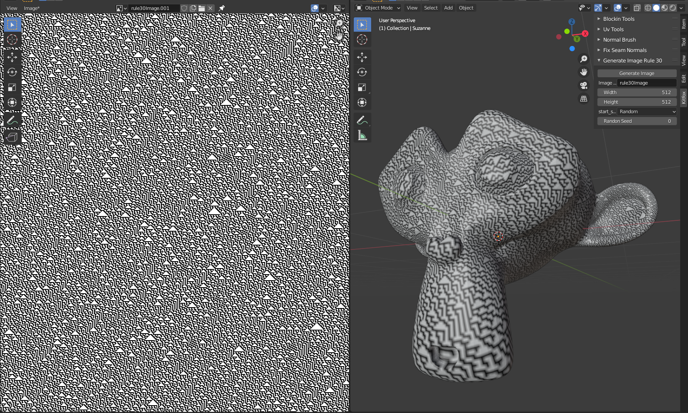

# Cellular Automata Images for Blender

Generates a texture using a cellular automata algorithm.  Generated images are stored in Blender's memory, so you may want to save it to disk after it's generated.

## Rule 30

An implementation of Stephen Wolfram's Rule30 algorithm.  Creates a semi-repeating triangle pattern reminiscent of natural patterns like the surface of a seashell.  https://en.m.wikipedia.org/wiki/Rule_30

#### Image Name
Name given to the texture that you generate.

#### Width
Width of generated image.

#### Height
Height of generated image.

#### Wrap
Wrap image in the X direction.

#### Start State
- **Single Cell** - Begin with a single black pixel centered on the edge of the image.  The triangle expands from there.  The classic start of the original algorithm.
- **Random** - The bottom edge of image is set to random values.  If wrap is not selected, the left edge is also set to random values.  These are used as the seeds that the Rule 30 pattern grows from.

#### Random Seed

Seed to initialize the random number generator.

## Building

To build, execute the *makeDeploy.py* script in the root of the project.  It will create a directory called *deploy* that contains a zip file containing the addon.

## Installation

To install, start Blender and select Edit > Preferences from the menubar.  Select the Add-ons tab and then press the Install button.  Browse to the .zip file that you built and select it.  Finally, tick the checkbox next to Add Mesh: Normal Brush.

